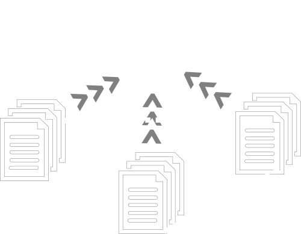
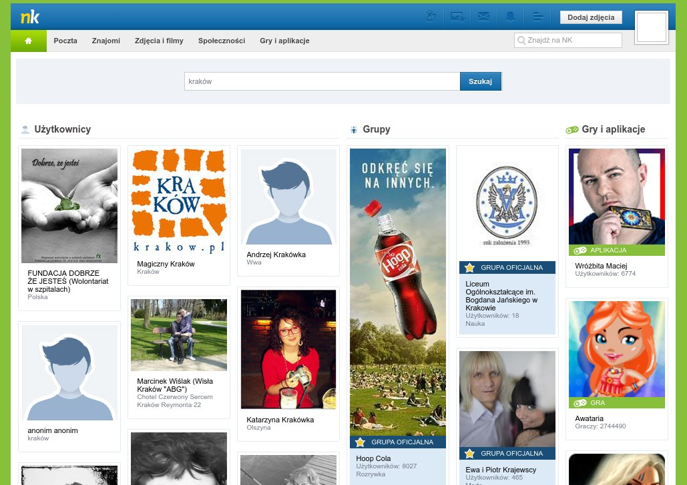

# Recon-ng
a web reconnaisance framework

---

# Why?

Before you start an active attack it's really useful to **gather as much information** on your target as possible.

However, collecting all the information and keeping track of all data (e-mails, logins, accounts, names...) is rather a **repetitive and tedious task**.

That's why we have...
### web reconnaisance frameworks

They help you gather information from thirdparty sources...<br /><br />


... keep track of the data that you already have ...<br /><br />


... and discover useful connections between your entries.<br /><br />


---

# Recon-ng

### Recon-ng
- written in Python 3
- easy to understand
- easy to use
- easy to extend
- usage is similar to Metasploit
- allows to interact with data in SQL style

### Author
Tim Tomes AKA LaNMaSteR53
https://bitbucket.org/LaNMaSteR53/recon-ng


#### From the author
*Recon-ng has a look and feel similar to the Metasploit Framework,
reducing the learning curve for leveraging the framework.
However, it is quite different. **Recon-ng is not intended 
to compete with existing frameworks, as it is designed
exclusively for web-based open source reconnaissance.** *

#### From the author<br />
*If you want to exploit...<br />
... use the Metasploit Framework.<br /><br />
If you want to social engineer<br />
... use the Social-Engineer Toolkit.<br /><br />
If you want to conduct reconnaissance<br />
... use **Recon-ng**!*

---

# Let's try it!

### Hello
```
> git clone https://bitbucket.org/LaNMaSteR53/recon-ng
> cd recon-ng
> pip install -r REQUIREMENTS
> python recon-ng
```

### Hello         
```
    _/_/_/    _/_/_/_/    _/_/_/    _/_/_/    _/      _/            _/      _/    _/_/_/
   _/    _/  _/        _/        _/      _/  _/_/    _/            _/_/    _/  _/       
  _/_/_/    _/_/_/    _/        _/      _/  _/  _/  _/  _/_/_/_/  _/  _/  _/  _/  _/_/_/
 _/    _/  _/        _/        _/      _/  _/    _/_/            _/    _/_/  _/      _/ 
_/    _/  _/_/_/_/    _/_/_/    _/_/_/    _/      _/            _/      _/    _/_/_/    
 
 
  
[77] Recon modules
[8]  Reporting modules
[2]  Import modules
[2]  Exploitation modules
[2]  Discovery modules
[1]  Disabled modules
[recon-ng][default] > 
```

### Different module types
- `recon` - web reconnaisance modules
- `reporting` - export data to csv, pdf...
- `import` - import data from csv, ...

```
[recon-ng][default] > search github
[*] Searching for 'github'...
  Recon
  -----
    recon/companies-multi/github_miner
    recon/profiles-contacts/github_users
    recon/profiles-repositories/github_repos
    recon/repositories-profiles/github_commits
    recon/repositories-vulnerabilities/github_dorks
```
**Search** for module you need, using keywords.

### Naming convention<br />
`recon/${FROM}-${TO}/${SERVICE}`<br /><br />
Such module tries to map the data from `FROM` to `TO` using `SERVICE`.

### Types of data
`FROM` and `TO` can be: 
- `companies`
- `profiles`
- `domains`
- `hosts`
- `locations`
- `...`

### See the schema
For full list of what-is-what and what-is-where, check out
```
[recon-ng][default] > show schema
```

### See the schema
For example:
```
  +--------------------+    +--------------------+
  |      contacts      |    |    repositories    |
  +--------------------+    +--------------------+
  | first_name  | TEXT |    | name        | TEXT |
  | middle_name | TEXT |    | owner       | TEXT |
  | last_name   | TEXT |    | description | TEXT |
  | email       | TEXT |    | resource    | TEXT |
  | title       | TEXT |    | category    | TEXT |
  | region      | TEXT |    | url         | TEXT |
  | country     | TEXT |    | module      | TEXT |
  | module      | TEXT |    +--------------------+
  +--------------------+
```

```
[recon-ng][default] > load recon/profiles-repositories/github_repos
[recon-ng][default][github_repos] > 
```
**Loading** a module changes the context that you're in.

``` 
[recon-ng][default][github_users] > show info
 
      Name: Github Profile Harvester
      Path: modules/recon/profiles-contacts/github_users.py
    Author: Tim Tomes (@LaNMaSteR53)
      Keys: github_api
 
Description:
  Uses the Github API to gather user info from harvested profiles. Updates the 'contacts' table with
  the results.
 
Options:
  Name    Current Value  Required  Description
  ------  -------------  --------  -----------
  SOURCE  default        yes       source of input (see 'show info' for details)
 
Source Options:
  default        SELECT DISTINCT username FROM profiles WHERE username IS NOT NULL AND resource LIKE 'Github'
  <string>       string representing a single input
  <path>         path to a file containing a list of inputs
  query <sql>    database query returning one column of inputs
```
**Show** the information about the module.

### Multiple input types
You can perform the reconnaisance for one or few selected inputs (`<string>`, `<path>`) or let recon-ng perform it for the whole database.

```
[recon-ng][default][github_users] > set SOURCE defunkt
SOURCE => defunkt
```
Set sample source...

```
[recon-ng][default][github_users] > run
[!] Message from Github: Bad credentials.
```
... and run. **Bad credentials?!**

### Acquiring API Keys
Most of thirdparty modules require an API key to work. These can be acquired in many different ways - some easier and some more difficult. Some tips from the creators are mentioned [here](https://bitbucket.org/LaNMaSteR53/recon-ng/wiki/Usage%20Guide#!acquiring-api-keys).

```
[recon-ng][default][github_users] > keys add github_api XXX_YOUR_API_KEY_XXX
[*] Key 'github_api' added.
```
Ah, that's better.

```
[recon-ng][default][github_users] > run
[*] [contact] Chris Wanstrath (chris@github.com) - Github Contributor at @github 
 
-------
SUMMARY
-------
[*] 1 total (1 new) contacts found.
[recon-ng][default][github_users] > 
```
Information about the github profile have been added.

```
[recon-ng][default][github_users] > show contacts
  +--------------------------------------------------------------------------------------------------------------------------------------------------------------------------------------------------------+
  | rowid | first_name | middle_name | last_name |          email          |                                        title                                         |     region    | country |    module    |
  +--------------------------------------------------------------------------------------------------------------------------------------------------------------------------------------------------------+
  | 1     | Chris      |             | Wanstrath | chris@github.com        | Github Contributor at @github                                                        | San Francisco |         | github_users |
  +--------------------------------------------------------------------------------------------------------------------------------------------------------------------------------------------------------+
```
You can also **show** the contents of the database directly.

---

# Development

Recon-ng is a modular framework. The structure of the modules makes it **very easy to contribute**. A detailed development guide is available [here](https://bitbucket.org/LaNMaSteR53/recon-ng/wiki/Development%20Guide).

### Basic module template
```
from recon.core.module import BaseModule
 
class Module(BaseModule):
 
    meta = {
        # metadata
    }
 
    def module_run(self, input):
        # do something with input and save to db
```

### Metadata
```
{
  'name': 'Hostname Resolver',
  'author': 'Tim Tomes (@LaNMaSteR53)',
  'version': 'v0.0.1',
  'description': 'Resolves IP addresses to hosts and updates the database with the results.',
  'required_keys': ['webdns_api', 'webdns_secret'], // required API keys
  'comments': (
      'Nameserver must be in IP form.',
      'e.g. 1.2.3.4',
  ),
  'query': 'SELECT DISTINCT host FROM hosts WHERE host IS NOT NULL', // SQL query for default input
  'options': ( 
      ('nameserver', '8.8.8.8', 'yes', 'ip address of a valid nameserver'), // CLI options
  ),
}
```

### Threads
```
from recon.core.module import BaseModule
 
class Module(BaseModule):
 
    # ...
 
    def module_run(self, inputs):
        # ...
        for input in inputs:
            self.thread(hosts, input)
 
    def module_thread(self, input)
        # do something with every single input in threads
```

---

# Our contibution

---

#### It's easy, right?
# Nasza Klasa



Nasza Klasa (pl. *Our Class*) is one of the most popular Polish social web apps, connecting old friends from school or youth. It's estimated to have around 7 000 000 active users.<br /><br />
A successful implementation would allow us to get origin cities of profiles as well as discover connections between them.

#### Research
- there is official [API](http://developers.nk.pl/documentation/nk-api/), but seems not actively developed
- available endpoints seem to cover our needs
- we've discovered *semi-official* user search by sniffing XHR requests `http://nk.pl/szukaj/profile/js?autocompleter=1&q=janusz`

#### Problems
- in official API we can send requests about users only when we have the ID of user
- *semi-official* search returns only 5 items (and account is blocked when too many requests are sent)...
- ... plus these results are based on the profile that you're logged in (favours people in your network)

#### Final result
### It (probably) won't work
Without official search, we cannot obtain ID of user, and, therefore, cannot get any useful information on him. **Matching users based only on names and surnames is too risky.**

---

#### Let's try again...
# Facebook

An useful implementation would work on company name and use *people who work at <>* Facebook query to get names and surnames of its employees.

#### Research
- there were several attempts of making such plugin...
- ... but [there were problems with them](https://bitbucket.org/LaNMaSteR53/recon-ng/issues/151/facebook-module-error)
- Facebook has a [very extensive API](https://developers.facebook.com/)

#### Problems
- API does not support *people who work at <>* search
- webpage is complicated and is difficult to scrap
- different pages have very different structure (probably to prevent automatic scrapping, like the one that we are trying to do)

#### Final status
### It worked...
Few hours of fiddling with RegExps and we got a successful implementation and scrapped a few thousands of employees.

<iframe width="853" height="480" src="https://www.youtube.com/embed/dOV71FPTcdk?rel=0" frameborder="0" allowfullscreen></iframe>

#### Final status
### ...but it doesn't any more :(
After a few days, it turned out that Facebook has completely changed the structure of their pages and the module is not working. None of the RegExps that we used works.

---

#### Third time's a charm?
# Goldenline


Goldenline is a Polish professional networking app, similar to LinkedIn. There are profiles of companies as well as profiles of professionals, looking for job of advice.

#### Research
- there is official, well-documented [API](https://github.com/GoldenLine/API)
- list of company's employees can be obtained via `GET /firms/{id}/employees`
- companies search can be implemented via parsing the site `http://www.goldenline.pl/firmy/szukaj/?q=Microsoft`

#### Problems
- unable to easily obtain API token - fortunately there's [HAL Browser](https://www.goldenline.pl/aplikacja/hal-browser/#https://api.goldenline.pl/)

### Final status: it works!
The module is located in **companies-contacts** - it enumerates employees based of given companies.<br />
https://bitbucket.org/LaNMaSteR53/recon-ng/pull-requests/262/add-module-companies-contacts-for/diff

<iframe width="853" height="480" src="https://www.youtube.com/embed/cGXXWIjc4KU?rel=0" frameborder="0" allowfullscreen></iframe>

---

### Who are we
We are Master's students at AGH University of Science and Technology in Kraków, Poland. 


### Who are we
Our major is Teleinformatics (**Teleinformatyka**) - an intersection of computer science, telecommunications and signal analysis.<br />
More info can be found [here](http://teleinformatyka.kt.agh.edu.pl/) (Polish only).

### Thank you!
Dominik Rosiek ([@Wolodija](https://github.com/Wolodija))<br />
Grzegorz Pietrusza([@jifwin](https://github.com/jifwin))<br />
Daniel Ślusarczyk ([@danslu](https://github.com/danslu))<br />
Antoni Grzanka ([@anteq](https://github.com/anteq))<br />
Michał Bardziński<br />
Tomasz Jaśkowiec<br />
Paweł Nogieć<br />
